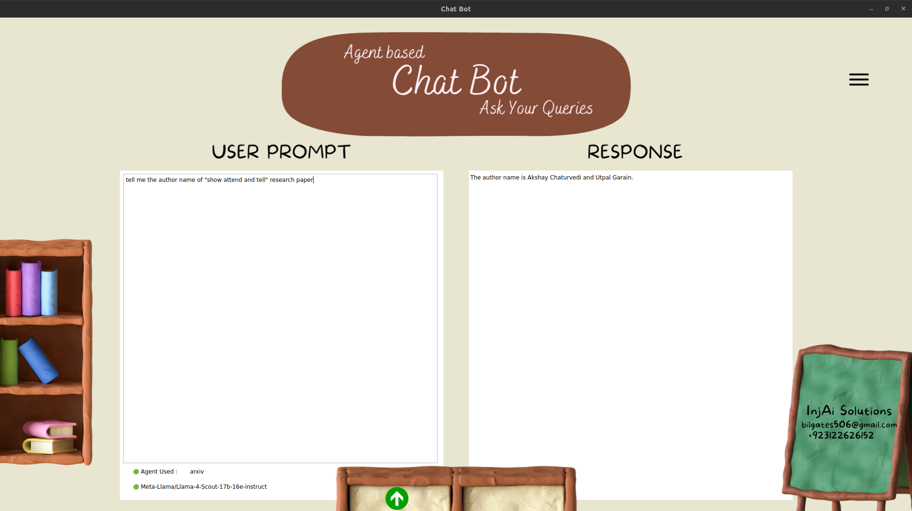

# 🤖 Simple Agent-Based Chatbot using LangGraph

This project demonstrates how to build a simple yet powerful **agent-based chatbot** using [LangGraph](https://github.com/langchain-ai/langgraph), LLMs, and modular tool nodes. The flow is structured as a graph, making it easy to expand, debug, and visualize.

---

## 🧠 Features

- Tool node integration  
- Stateful message handling  
- Configurable LLM node  
- LangGraph flow builder  
- Graph visualization  
- Run-ready chatbot function

---

## ⚙️ Components

1. **Tool Setup** – Create tool nodes (e.g., search, calculator, custom tools)  
2. **State Definition** – Manage user inputs, history, and tool outputs  
3. **LLM Configuration** – Connect to an LLM (OpenAI, Claude, etc.)  
4. **LLM Node** – Define how the LLM processes the current state  
5. **Graph Construction** – Build the chatbot logic flow using LangGraph  
6. **Visualization** – Print or visualize the graph structure  
7. **Run Function** – Start and interact with the chatbot

---

## 🖼️ Screenshot



> A high-level view of the LangGraph-based chatbot workflow.

---

## 🚀 Getting Started

### 1. Clone the Repository and Run

```bash
git clone https://github.com/MalikAbdulSalam/Agent_based_chatbot.git
cd Agent_based_chatbot
conda env create -f environment.yml
conda activate agentic_ai
python main.py
**Note** – Add your groq API key in line 33 of "multi_agentic_chatbot.py"
